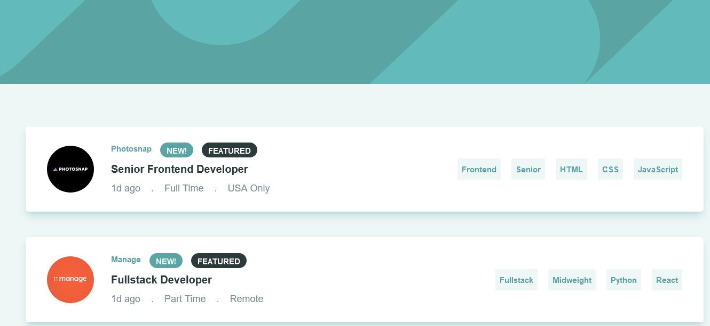

# Frontend Mentor - Job listings with filtering solution

This is a solution to the [Job listings with filtering challenge on Frontend Mentor](https://www.frontendmentor.io/challenges/job-listings-with-filtering-ivstIPCt). Frontend Mentor challenges help you improve your coding skills by building realistic projects.

## Table of contents

- [Overview](#overview)
  - [The challenge](#the-challenge)
  - [Screenshot](#screenshot)
  - [Links](#links)
- [My process](#my-process)
  - [Built with](#built-with)
  - [What I learned](#what-i-learned)
  - [Continued development](#continued-development)
- [Author](#author)
- [Acknowledgments](#acknowledgments)

### The challenge

Users should be able to:

- View the optimal layout for the site depending on their device's screen size
- See hover states for all interactive elements on the page
- Filter job listings based on the categories

### Screenshot

- Live Site URL: [Live Preview](https://main--jobby-filter.netlify.app/)

## My process

### Built with

- Semantic HTML5 markup
- CSS custom properties
- Flexbox
- CSS Grid
- Mobile-first workflow
- [React](https://reactjs.org/) - JS library
- [TailwinCss](https://tailwindcss.com/) - Css framework

### What I learned

building this project helped me understand how to filter array of object with multiple caterias and made me discover new js constructor 'every'

### Continued development

uhmm still have to work on the remove filter button, because i'm still getting an error

## Author

- Frontend Mentor - [@yourusername](https://www.frontendmentor.io/profile/Ohzuma)
- Twitter - [@yourusername](https://www.twitter.com/Ohzuma)

## Acknowledgments

wanna give a shoutout to the person that owns this repo-[https://github.com/Flomhw/Reactjobsandfilter/blob/Main/src/Jobs.js]

this help me understand and implement so of the functionality thanks!!
